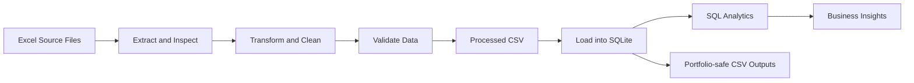
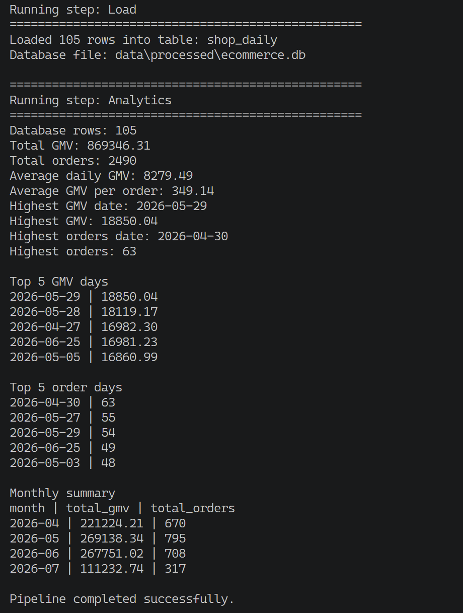
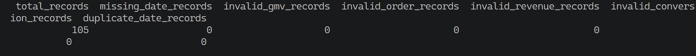

# E-commerce Data Pipeline

An end-to-end Data Engineering project for ingesting, cleaning, validating, transforming, loading, analyzing, and exporting multi-source e-commerce Excel data.

The pipeline uses Python, Pandas, SQL, SQLite, and OpenPyXL to convert raw Excel files into structured, validated, and analysis-ready datasets.

---

## Project Overview

This project demonstrates a complete ETL pipeline using:

- Python
- Pandas
- SQL
- SQLite
- OpenPyXL
- Excel ingestion
- Data cleaning
- Data transformation
- Data validation
- SQLite loading
- SQL analytics
- Portfolio-safe CSV exports
- Git and GitHub

The project processes daily e-commerce performance data containing metrics such as:

- GMV
- Orders
- Customers
- Items sold
- Revenue
- Page views
- Visitors
- Conversion rate
- Average order value
- Product impressions
- Product clicks
- Live GMV metrics
- Video GMV metrics

---

## Pipeline Architecture



---

## Pipeline Stages

The pipeline performs the following steps:

1. Inspect Excel source files
2. Read and combine multiple source files
3. Standardize column names
4. Convert Thai and inconsistent column names into consistent English names
5. Clean numeric and date fields
6. Handle missing and invalid values
7. Validate the processed dataset
8. Export the cleaned data to CSV
9. Load the processed data into SQLite
10. Run SQL-based analysis
11. Export portfolio-safe sample outputs

---

## Technologies

| Technology | Purpose |
|---|---|
| Python | Pipeline orchestration and scripting |
| Pandas | Data cleaning and transformation |
| SQL | Data analysis and validation |
| SQLite | Local relational database |
| OpenPyXL | Excel file ingestion |
| Git | Version control |
| GitHub | Portfolio publishing |

---

## Project Structure

```text
ecommerce-data-pipeline/
├── data/
│   ├── raw/
│   │   ├── campaign/
│   │   ├── influencer/
│   │   ├── payment/
│   │   ├── shop/
│   │   └── .gitkeep
│   ├── staging/
│   │   └── .gitkeep
│   └── processed/
│       ├── portfolio_outputs/
│       │   ├── sample_channel_gmv_metrics.csv
│       │   ├── sample_daily_performance.csv
│       │   ├── sample_data_quality_summary.csv
│       │   ├── sample_top_revenue_days.csv
│       │   └── sample_traffic_conversion_summary.csv
│       └── .gitkeep
├── docs/
│   └── images/
│       ├── data_quality_passed.png
│       └── pipeline_success.png
├── src/
│   ├── analytics/
│   │   └── analyze_shop.py
│   ├── export/
│   │   └── export_portfolio_outputs.py
│   ├── extract/
│   │   └── inspect_excel.py
│   ├── load/
│   │   └── load_shop_sqlite.py
│   └── transform/
│       └── clean_shop.py
├── run_pipeline.py
├── requirements.txt
├── .gitignore
└── README.md
```

The raw source files, staging data, processed database, and complete processed dataset are excluded from GitHub through `.gitignore`.

Only portfolio-safe sample outputs and documentation evidence are committed.

---

## Data Model

The processed data is loaded into the SQLite table:

```text
shop_daily
```

Important columns include:

```text
date
gmv
orders
customers
items_sold
refunded_items
sku_orders
total_revenue
page_views
visitors
conversion_rate
product_impressions
unique_product_impressions
product_clicks
unique_product_clicks
aov
live_gmv_creator
live_gmv_creator_direct
live_gmv_creator_indirect
live_gmv_linked_account
live_gmv_seller
live_gmv_seller_indirect
video_gmv_affiliate
video_gmv_creator
video_gmv_creator_indirect
video_gmv_linked_account
video_gmv_seller
video_gmv_seller_indirect
source_file
```

---

## Sample Results

The processed dataset contains:

```text
Total records: 105
```

Business results:

```text
Total GMV: 869,346.31
Total orders: 2,490
Average daily GMV: 8,279.49
Average GMV per order: 349.14

Highest GMV date: 2026-05-29
Highest GMV: 18,850.04

Highest orders date: 2026-04-30
Highest orders: 63
```

---

## Monthly Summary

| Month | Total GMV | Total Orders |
|---|---:|---:|
| 2026-04 | 221,224.21 | 670 |
| 2026-05 | 269,138.34 | 795 |
| 2026-06 | 267,751.02 | 708 |
| 2026-07 | 111,232.74 | 317 |

May 2026 generated the highest monthly GMV and the highest number of orders in the dataset.

---

## Data Quality Validation

The pipeline validates important data-quality conditions before portfolio outputs are generated.

Validation checks include:

- Missing dates
- Invalid dates
- Duplicate dates
- Missing values
- Invalid GMV values
- Negative GMV values
- Invalid order counts
- Negative order counts
- Invalid revenue values
- Negative revenue values
- Missing conversion rates
- Negative conversion rates

Current validation result:

```text
Total records: 105
Missing dates: 0
Invalid GMV records: 0
Invalid order records: 0
Invalid revenue records: 0
Invalid conversion records: 0
Duplicate dates: 0
```

All 105 processed records passed the configured validation rules.

---

## Pipeline Evidence

### End-to-End Pipeline Success



The pipeline successfully completed the Transform, Load, and Analytics stages.

Key execution results:

```text
Source files found: 5
Source files processed: 4
Combined records: 105
Invalid dates: 0
Duplicate dates: 0
Missing values: 0
Negative values: 0
Loaded records: 105
Target table: shop_daily
Pipeline status: Success
```

The final execution completed with:

```text
Pipeline completed successfully.
```

### Data Quality Evidence



All configured data quality checks passed.

```text
Total records: 105
Missing dates: 0
Invalid GMV records: 0
Invalid order records: 0
Invalid revenue records: 0
Invalid conversion records: 0
Duplicate dates: 0
```

---

## Portfolio Outputs

The project includes portfolio-safe CSV outputs generated from the SQLite database.

Run the export script with:

```bash
python src/export/export_portfolio_outputs.py
```

Output directory:

```text
data/processed/portfolio_outputs/
```

The export process creates five files.

### `sample_daily_performance.csv`

Contains the first 30 daily records ordered by date.

Included metrics:

- Date
- GMV
- Orders
- Customers
- Items sold
- Total revenue
- Page views
- Visitors
- Conversion rate
- Average order value

### `sample_top_revenue_days.csv`

Contains the top 10 dates ranked by total revenue.

Included metrics:

- Date
- Total revenue
- GMV
- Orders
- Customers
- Average order value
- Conversion rate

### `sample_traffic_conversion_summary.csv`

Contains aggregated traffic, conversion, and revenue metrics across the complete dataset.

Included metrics:

- Total days
- Total page views
- Total visitors
- Total product impressions
- Total product clicks
- Average conversion rate
- Average order value
- Total revenue

Current summary:

```text
Total days: 105
Total page views: 68,560
Total visitors: 47,405
Total product impressions: 1,796,607
Total product clicks: 72,136
Average conversion rate: 0.0546
Average order value: 348.33
Total revenue: 979,850.99
```

### `sample_channel_gmv_metrics.csv`

Contains individual live and video GMV attribution metrics.

Included fields:

- Total shop GMV
- Live creator GMV
- Live creator direct GMV
- Live creator indirect GMV
- Live linked-account GMV
- Live seller GMV
- Live seller indirect GMV
- Video affiliate GMV
- Video creator GMV
- Video creator indirect GMV
- Video linked-account GMV
- Video seller GMV
- Video seller indirect GMV

The channel metrics are intentionally exported separately.

Creator, seller, linked-account, direct, and indirect attribution fields may overlap. Adding all attribution fields together could create misleading totals through double counting.

### `sample_data_quality_summary.csv`

Contains a summary of the validation results.

Included checks:

- Total record count
- Missing dates
- Invalid GMV records
- Invalid order records
- Invalid revenue records
- Invalid conversion-rate records
- Duplicate dates

---

## Metric Definition and Double-counting Prevention

Some channel attribution metrics can describe overlapping portions of the same transaction.

For example:

```text
Creator
Seller
Linked account
Direct attribution
Indirect attribution
```

These fields should not automatically be added together unless the source system confirms that they are mutually exclusive.

The export layer therefore reports these metrics separately rather than creating an unsupported combined live-GMV or video-GMV total.

This design reduces the risk of:

- Double counting
- Misleading summaries
- Incorrect channel comparisons
- Unsupported business conclusions

---

## Challenges

### Inconsistent Source Schemas

The source Excel files contained column names in different formats.

Some columns contained:

- Extra spaces
- Thai column names
- Inconsistent naming conventions
- Different data types
- Missing values

The pipeline addressed these issues by:

- Inspecting source schemas before transformation
- Standardizing column names
- Mapping source columns to consistent English names
- Validating the final schema before loading

### Mixed Data Types

Some numeric columns contained text values, causing Pandas to treat them as object columns instead of numeric fields.

The pipeline addressed this by:

- Converting numeric columns with `pd.to_numeric`
- Converting invalid values into missing values
- Checking invalid record counts
- Filling or correcting invalid values before export

### Invalid Revenue Value

The revenue column contained one value that could not be converted directly into a number.

The pipeline:

1. Detected the invalid value
2. Converted it to a missing value
3. Replaced it with `0.00`
4. Validated the cleaned result
5. Loaded the corrected data into SQLite

### Overlapping Attribution Metrics

Live and video attribution fields can overlap.

A simple sum across creator, seller, direct, indirect, and linked-account metrics could overstate channel performance.

The portfolio export layer solves this by exporting each attribution metric separately.

---

## Lessons Learned

Through this project, I learned how to:

- Organize a data pipeline into Extract, Transform, Load, Analytics, and Export stages
- Inspect Excel source files before processing
- Standardize inconsistent column names
- Clean mixed data types with Pandas
- Validate dates, numeric fields, missing values, and duplicate records
- Separate extraction, transformation, loading, analytics, and export responsibilities
- Load processed data into SQLite
- Write SQL queries for daily and monthly business analysis
- Generate portfolio-safe sample outputs
- Avoid double counting in overlapping business metrics
- Protect private and generated data with `.gitignore`
- Use Git and GitHub to version and publish a Data Engineering project

---

## Installation

Clone the repository:

```bash
git clone https://github.com/bodinkc30-Pete/ecommerce-data-pipeline.git
```

Move into the project directory:

```bash
cd ecommerce-data-pipeline
```

Create a virtual environment:

```bash
python -m venv .venv
```

Activate the virtual environment on Windows:

```bash
.venv\Scripts\activate
```

Install the required packages:

```bash
python -m pip install -r requirements.txt
```

---

## Run the Pipeline

Run the complete ETL and analytics pipeline:

```bash
python run_pipeline.py
```

The command runs the following stages:

```text
Transform
→ Load
→ Analytics
```

Expected final result:

```text
Pipeline completed successfully.
```

---

## Export Portfolio Outputs

After the SQLite database has been created, run:

```bash
python src/export/export_portfolio_outputs.py
```

Expected result:

```text
[SUCCESS] สร้าง sample_daily_performance.csv: 30 แถว
[SUCCESS] สร้าง sample_top_revenue_days.csv: 10 แถว
[SUCCESS] สร้าง sample_traffic_conversion_summary.csv: 1 แถว
[SUCCESS] สร้าง sample_channel_gmv_metrics.csv: 1 แถว
[SUCCESS] สร้าง sample_data_quality_summary.csv: 1 แถว
[SUCCESS] สร้าง Portfolio Outputs ครบทุกไฟล์แล้ว
[INFO] จำนวนไฟล์: 5
[INFO] จำนวนแถวรวม: 43
```

---

## Repository Safety

The repository excludes private, raw, and generated data.

Excluded items include:

```text
.venv/
data/raw/
data/staging/
data/processed/ecommerce.db
data/processed/shop_daily.csv
.env
.vscode/
```

Only portfolio-safe CSV files inside this directory are committed:

```text
data/processed/portfolio_outputs/
```

Documentation evidence is stored in:

```text
docs/images/
```

The `.gitignore` configuration prevents raw Excel files, the SQLite database, staging data, and the complete processed dataset from being published.

---

## Key Data Engineering Skills Demonstrated

- Data Engineering
- ETL
- Python
- Pandas
- SQL
- SQLite
- Excel ingestion
- Data cleaning
- Data transformation
- Data validation
- Data quality
- Database loading
- SQL analytics
- Metric definition
- Double-counting prevention
- Portfolio-safe data publishing
- Git and GitHub

---

## Author

Data Engineering Portfolio Project

Focused on building reproducible, maintainable, validated, and portfolio-safe data pipelines using Python, Pandas, SQL, and SQLite.